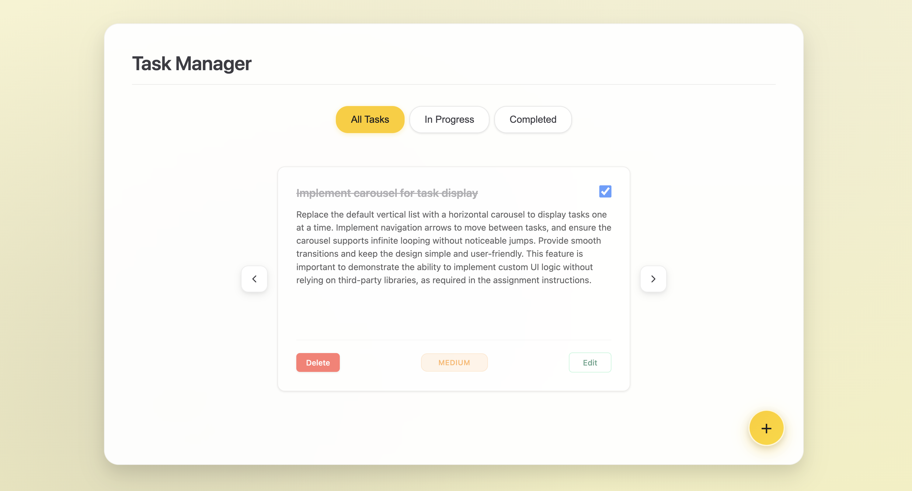
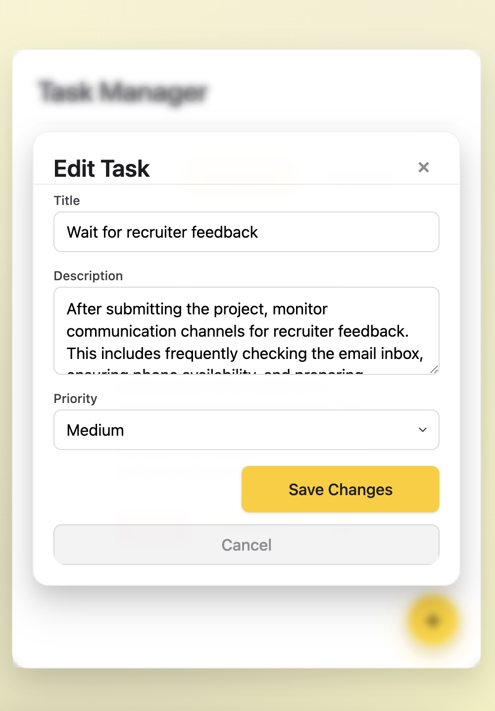
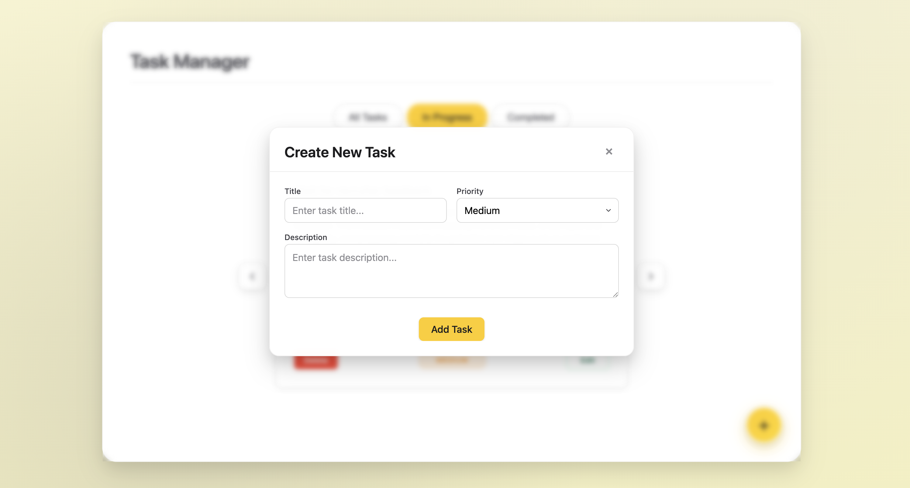

# Task Manager

A modern task management system built with React and Node.js, featuring full CRUD operations and responsive design.

## Features

- Create, edit, and delete tasks
- Mark tasks as completed/incomplete
- Filter tasks by status (all, pending, completed)
- Priority levels (high, medium, low)
- Responsive design with mobile support
- Clean and modern user interface
- Confirmation modal for task deletion

## Screenshots

### Main Interface Views

<div align="center">

#### Desktop View  


*Desktop interface displaying task management with filtering options*

</div>

### Mobile & Modal Features

<div align="center">

| Mobile View | Edit Task Modal |
|-------------|-----------------|
|  |  |
| *Mobile-responsive design with priority indicators* | *Task editing interface with form validation* |

#### Create New Task Modal


*Task creation modal with title, description, and priority fields*

</div>

## Installation and Setup

### Environment Setup
```bash
# Clone the project
git clone https://github.com/bartawil/bar_tawil_helfy_task.git
cd bar_tawil_helfy_task
```

### Backend
```bash
cd backend
npm install
node server.js
```
Server will run on http://localhost:4000

### Frontend
```bash
cd frontend
npm install
npm start
```
Application will be available on http://localhost:3000

## Project Structure

```
task-manager/
├── README.md
├── .gitignore
├── backend/                    # Node.js server with Express
│   ├── package.json           # Backend dependencies
│   ├── server.js              # Main server entry point
│   ├── db/
│   │   └── tasks_collection.js # Temporary database (in-memory array)
│   ├── middleware/            # Custom middleware
│   │   ├── errorHandler.js    # Global error handling
│   │   ├── logger.js          # HTTP request logging
│   │   └── validateTask.js    # Data validation and sanitization
│   └── routes/
│       └── tasks.js           # Task API routes
└── frontend/                   # React application
    ├── package.json           # Frontend dependencies
    ├── public/                # Static files
    │   ├── index.html
    │   ├── favicon.ico
    │   └── ...
    └── src/
        ├── App.js             # Main component
        ├── index.js           # Application entry point
        ├── components/        # React components
        │   ├── TaskList.js    # Task list display
        │   ├── TaskItem.js    # Individual task item
        │   ├── TaskForm.js    # Task creation/editing form
        │   ├── TaskFilter.js  # Task filter component
        │   ├── Modal.js       # Generic modal component
        │   └── ConfirmDeleteModal.js # Delete confirmation modal
        ├── services/
        │   └── taskService.js # API service for backend communication
        └── styles/            # CSS files
            ├── App.css
            ├── TaskList.css
            ├── TaskItem.css
            ├── TaskForm.css
            └── Modal.css
```

## Implementation Overview

### CRUD Operations
The system implements full CRUD operations:
- **Create** - Create new tasks with title, description, and priority
- **Read** - Fetch all tasks with filtering options
- **Update** - Update task details (title, description, priority, status)
- **Delete** - Delete tasks with user confirmation

### API Endpoints
- `GET /api/tasks` - Retrieve all tasks
- `POST /api/tasks` - Create new task
- `PUT /api/tasks/:id` - Full task update
- `PATCH /api/tasks/:id/toggle` - Toggle completion status
- `DELETE /api/tasks/:id` - Delete task

### Validations
- Title: Required, 1-100 characters
- Description: Optional, up to 500 characters
- Priority: low, medium, high
- HTML tag removal to prevent XSS
- Separate validation for creation and updates

## Middleware Explanation

### Built-in Middleware
- **cors()** - Enables Cross-Origin requests from frontend
- **express.json()** - Parses JSON from HTTP requests

### Custom Middleware
1. **Logger** (`middleware/logger.js`)
   - Logs all HTTP requests with method and URL
   - Helps track server activity

2. **Validate Task** (`middleware/validateTask.js`)
   - Comprehensive task data validation
   - Sanitization to remove HTML tags
   - Separate validation for creation and updates
   - Checks length, type, and content of fields

3. **Error Handler** (`middleware/errorHandler.js`)
   - Global error handling
   - Returns structured and safe error responses
   - Hides technical details in production environment

## Error Handling

### Backend
- **Validation errors**: HTTP 400 with specific message
- **Task not found**: HTTP 404
- **Server errors**: HTTP 500 with generic message
- **Centralized location**: Error Handler middleware
- **Error logging**: For debugging purposes

### Frontend
- **Async handling**: try-catch with async/await
- **Error messages**: Logged to console
- **Graceful recovery**: Application continues functioning despite errors

## Frontend Explanation

### Main Components
1. **App.js** - Main component managing global state
2. **TaskList.js** - Displays task list with pagination
3. **TaskItem.js** - Individual task item with editing options
4. **TaskForm.js** - Form for creating and editing tasks
5. **TaskFilter.js** - Task filter (all/pending/completed)
6. **Modal.js** - Generic reusable modal component
7. **ConfirmDeleteModal.js** - Delete confirmation modal


### Backend Communication
- **taskService.js** - Service layer for all API calls
- **Fetch API** for HTTP requests
- **Async handling** with async/await
- **Error handling** with try-catch

**Technologies**: React 19, Node.js, Express.js, Vanilla CSS